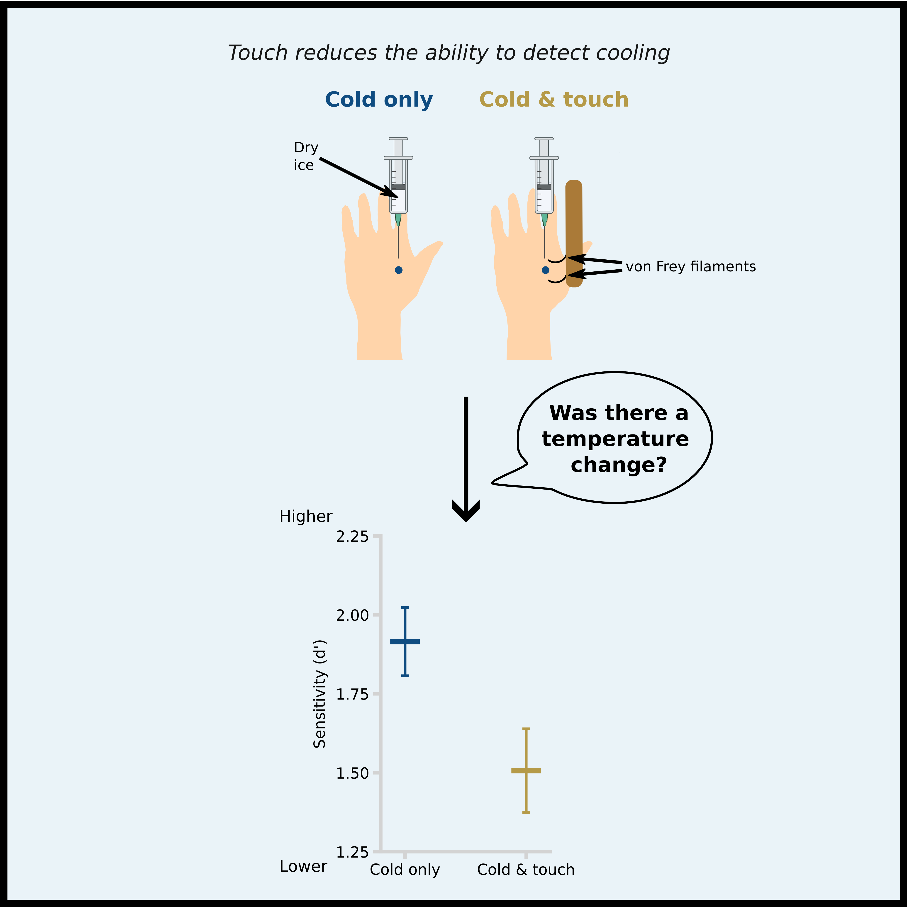

# Touch inhibits cold: non-contact cooling reveals a novel thermotactile gating mechanism :snowflake::cold_face::call_me_hand:
Version in journal:

Versions in Biorxiv: [version 1](https://www.biorxiv.org/content/10.1101/2024.08.06.606653v1)

[Data repository](data/)

## Abstract :page_with_curl:
Skin stimuli reach the brain via multiple neural channels specific for different stimulus types. These channels interact in the spinal cord, typically through inhibition. Inter-channel interactions can be investigated by selectively stimulating one channel and comparing the resulting sensations when another sensory channel is or is not concurrently stimulated. Applying this logic to thermal-mechanical interactions proved difficult, because most thermal stimulators involve direct skin contact. We developed a novel non-tactile stimulator for focal cooling (9mm2) by using thermal imaging of skin temperature as a feedback signal to regulate exposure to a dry ice source. We could then investigate how touch modulates cold sensation by delivering focal cooling to the human hand dorsum in either the presence or absence of light touch. Across three signal detection experiments, we found that sensitivity to cooling was significantly reduced by touch. This reduction was specific to touch, since it did not occur when presenting auditory signals instead of the tactile input, making explanations based on distraction or attention unlikely. Our findings suggest that touch inhibits cold perception, recalling interactions of touch and pain previously described by Pain Gate Theory. We show, for the first time, a thermotactile gating mechanism between mechanical and cooling signals.

## Authors :man_scientist::woman_scientist:
- Ivan Ezquerra-Romano
- Maansib Chowdhury
- Patrick Haggard

:key: **Keywords:** Somatosensation, Thermosensation, Gating, Psychophysics, Non-tactile cooling

### Environment :computer::floppy_disk:
- Devices: MacBook Pro (13-inch, 2019, Two Thunderbolt 3 ports) & Arduino Uno
- Operating system: macOS Monterey Version 12.4
- Programming languages: Python 3.8.6 & Arduino 1.8.19
